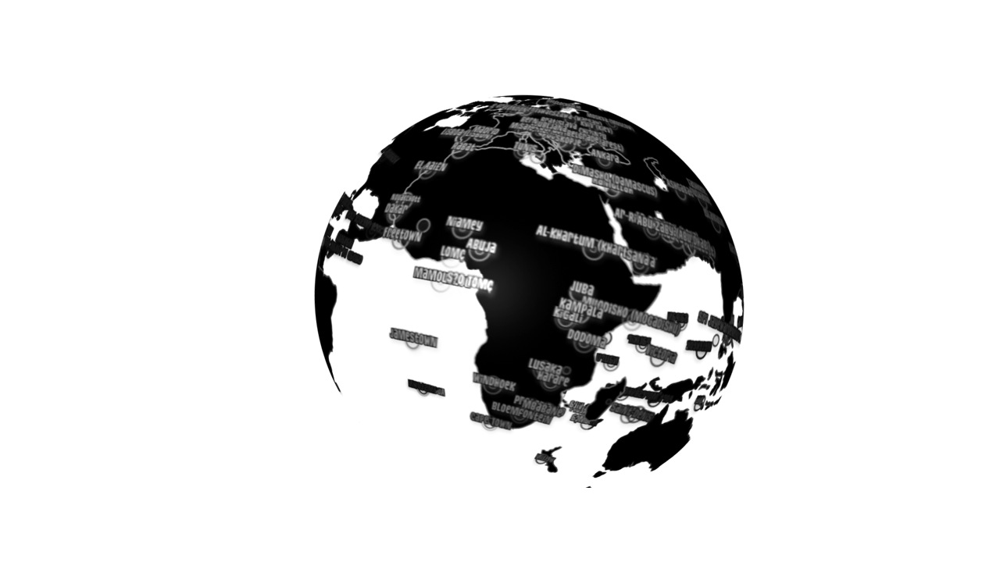

#The Beast is still under development.  
That means there will be some bugs, or some helptips missing, or a strange name on some buttons, but I really need feedback so I can smooth out the bumps and develop some new ideas.  

##Basic Idea / Usage
It is aimed to be a After Effects CS4+ script for creating georeferenced graphics. The idea is to use a [Json](http://www.json.org/) specification called [GeoJson](http://www.geojson.org/) to create points, linestrings polygons and multipolygons. These can be created using differnet techniques. You can write them yourself. Just dive into the GeoJson specifications. There are already lots of datasets available at [GeoCommons](http://geocommons.com) that can be used. Have a look @ the tutorials on how to create and use that data. If there are bugs report them on the [comment page](http://fabiantheblind.github.com/The-Geo-Beast/disqus.html) or enter an [issue on github](https://github.com/fabiantheblind/The-Geo-Beast/issues).  
  
##Downloads  

<input class="btn btn-large" type="button" id="bttn" onclick="window.open('https://github.com/downloads/fabiantheblind/The-Geo-Beast/The-Geo-Beast_BETA_v01.zip','_self')" value="The-Geo-Beast Script" /> 
 
<input class="btn btn-large" type="button" id="bttn" onclick="window.open('/The-Geo-Beast/GeoJsonToWavefrontOBJ.zip','_self')" value="GeoJson 2 OBJ Sketch" />

   
   
  
-----------------------  
  
##Tutorial Part 1 of 3   
This is the first part on how to create datasets that can be used. It is shown how to use google earth in combination with [geocommons](http://geocommons.com) for that. Go to [the tools site](http://fabiantheblind.github.com/The-Geo-Beast/tools.html) to get the bookmarklet that makes the geocommons api call for you.  
 

<iframe src="http://player.vimeo.com/video/46971862" width="500" height="281" frameborder="0" webkitAllowFullScreen mozallowfullscreen allowFullScreen></iframe> 
<a href="http://vimeo.com/46971862">The-Geo-Beast-Beta-Demo Part I</a>  

 

  

    

  
-----------------------  
  
##Tutorial Part 2 of 3  
In this part you will learn how to use this data in After Effects. If you downloaded [the AEMap Script](http://aescripts.com/aemap/) you already have the world_geo_json folder with the world map data and the countries.zip. If not go over and grap the AEMap script or download the world map and the seprate countries directly from the [creator johan](https://github.com/johan/world.geo.json/zipball/master). This will get you started. If will try to provide some more example files that are free to use.  

<iframe src="http://player.vimeo.com/video/47004870" width="500" height="281" frameborder="0" webkitAllowFullScreen mozallowfullscreen allowFullScreen></iframe> 
<a href="http://vimeo.com/47004870">The-Geo-Beast-Beta-Demo Part II</a>  

	
 

  

  
-----------------------  
  
##Tutorial Part 3 of 3  
In this last part I will show you how to use large datasets with a thousends of features. You can download the used [processing sketch here](/The-Geo-Beast/GeoJsonToWavefrontOBJ.zip), the used [Wavefront .obj lib](http://n-e-r-v-o-u-s.com/tools/obj.php) here and the [json lib here](https://github.com/agoransson/JSON-processing/downloads).  

<iframe src="http://player.vimeo.com/video/47007404" width="500" height="281" frameborder="0" webkitAllowFullScreen mozallowfullscreen allowFullScreen></iframe> 
<a href="http://vimeo.com/47007404">The-Geo-Beast-Beta-Demo Part III</a>

 

  

##Resources  
There are lots of sites out there where you can get and create geodata. This is a collection of links where you can look. I will add some more over time. If you find some good data leave a message at the comments.    
###Geo Data
- [Geo Names](http://www.geonames.org) lots of cities with data as .tsv or .csv convert them via [geocommons](http://geocommons.com)  
- [Geo Commons](http://geocommons.com) The site used in the tutorial  
- [Get Lat Lon ](http://www.getlatlon.com) A google maps tool that gets locations  

###Geo Coding  
- [Processing geo information in Wikipedia articles](http://tillnagel.com/2009/12/processing-geo-information-in-wikipedia-articles/)  



-   
-   
-   
-   
-   

#FAQ  

-----------------

###How will this work?   
Be patient young Jedi. The Beast will reveal itself in time.  

-----------------

###When will this be done?   
A really can't tell. But when it is done you will be notified via "The Web".   

-----------------

###Will this script be open-source?
Yes it shure will. I use so many open source ressources I would ruin my karma if I charge you for that. But still - some support is great. So it will be "Name Your Own Price" on aescripts.    

-----------------

###Why do you call it The Beast?  
Managing geodata is allways a pain in the ass. I've used to create geo projects at the university and it always made me nuts. If you start doing that. Be aware that it is a rabbits hole. There are thousends of diffrent geo data types, map projections, tools and images out there in the wastelands of the world wide world of webs. So you can get lost or be eaten by that beast.  
Also  I digg names like "openSesame", "Ease and Wizz", "Zorro-The-Layer-Tagger" or "Magnum The Edit Detector". These are good ideas and keep life on the funny side.

-----------------

###Are you nuts?  
No it's me who is normal - not the other way around. ;)

-----------------

###Isn't that "FAQ with questions nobody asked" joke old?  
Maybe but i didn't use him yet -and it's still funny…

-----------------   

###You want more?
If you want to take a peak into a AE project created with The Beast take a look at this [The Beast Placemarks Demo.tsv](asset/the_beast_placemarks_demo.tsv.txt). It is build with [pt_openSesame.jsx](http://aescripts.com/pt_opensesame/) so you can import it to any AE version.  



